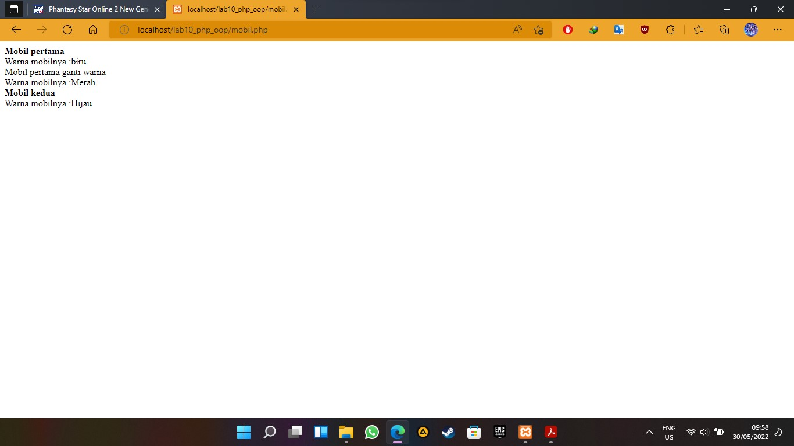
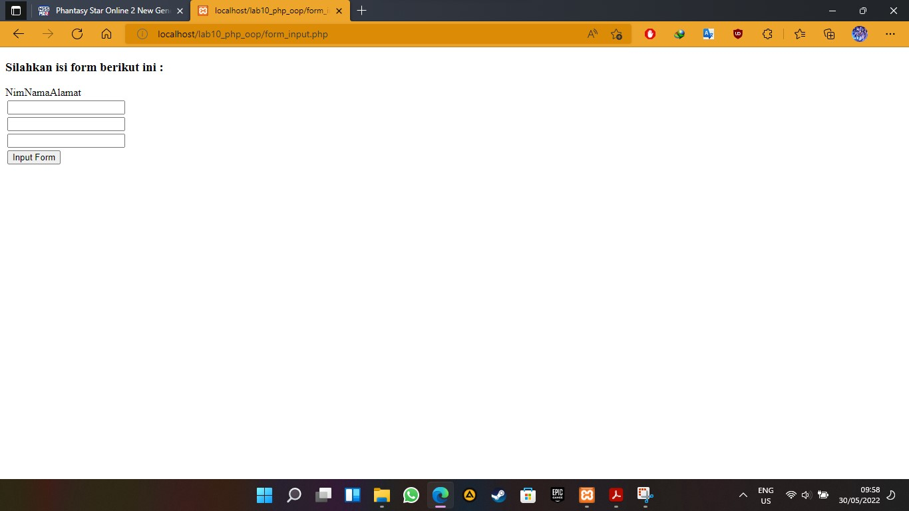

# Lab10WEB
# bagus tri handono - 312010170
# 20.TI.B1
============================================================= 
membuat OOP php. 
1.buat folder lab10_php_oop pada htdocs dan jalankan xammp 
2.buat file [mobil.php](code/mobil.php) lalu jalankan pada browser 
 
3.buat file [form.php](code/form.php) dan [form_input.php](code/form_input.php) 
4.lalu jalankan pada browser dan akan terlihat seperti gambar dibawah ini 

